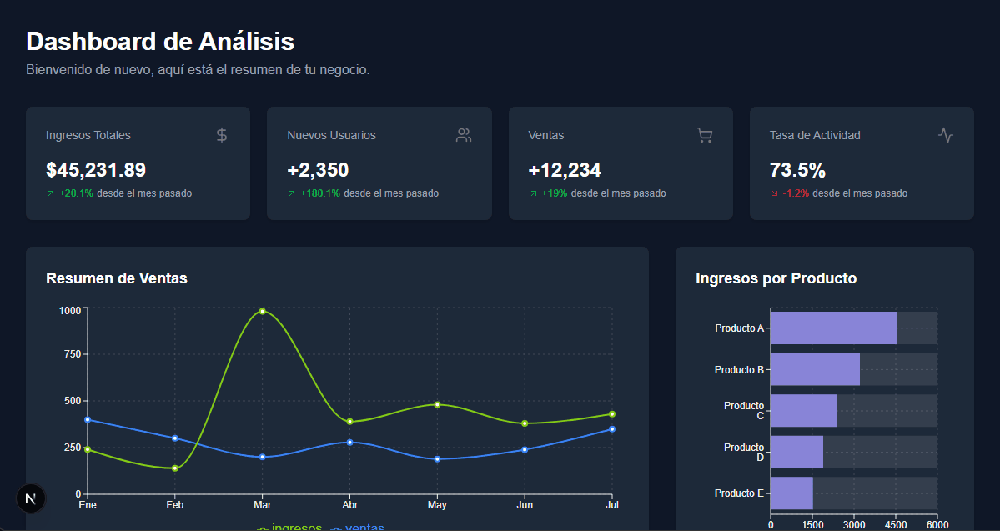

# Dashboard de Analíticas con React

> Un panel de control de analíticas interactivo y visualmente atractivo, construido con Next.js, TypeScript, Tailwind CSS y Recharts. Este proyecto demuestra la capacidad de transformar datos en bruto en información útil y comprensible.

**Ver el proyecto en vivo:** [**enlace-a-tu-dashboard-en-vercel.app**](https://dash-land-dave.vercel.app/)

---

## ✨ Características Destacadas

* **📊 Visualización de Datos:** Múltiples tipos de gráficos (barras, líneas, etc.) para presentar datos de forma clara.
* **⚛️ Componentes Reutilizables:** Estructura modular para cada tarjeta y gráfico.
* **🎨 Diseño Moderno:** Interfaz limpia y profesional estilizada con Tailwind CSS.
* **📱 Totalmente Responsivo:** Se adapta perfectamente a cualquier tamaño de pantalla.

---

## 🛠️ Stack Tecnológico

